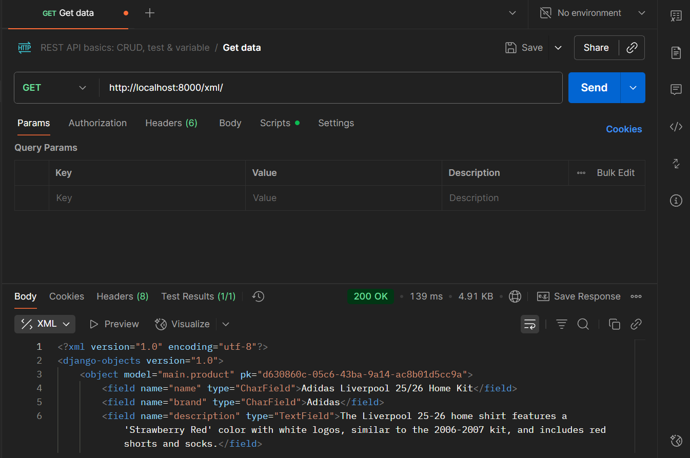
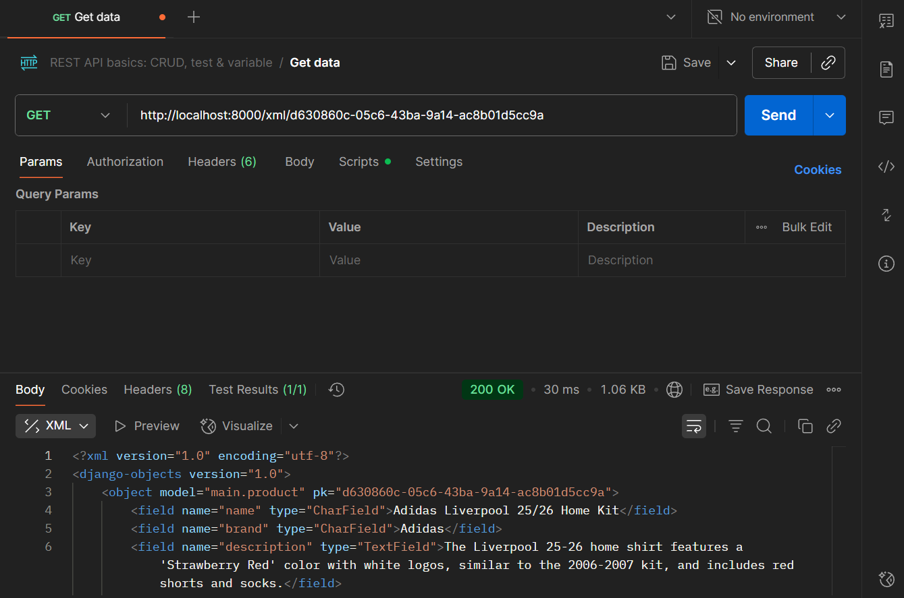
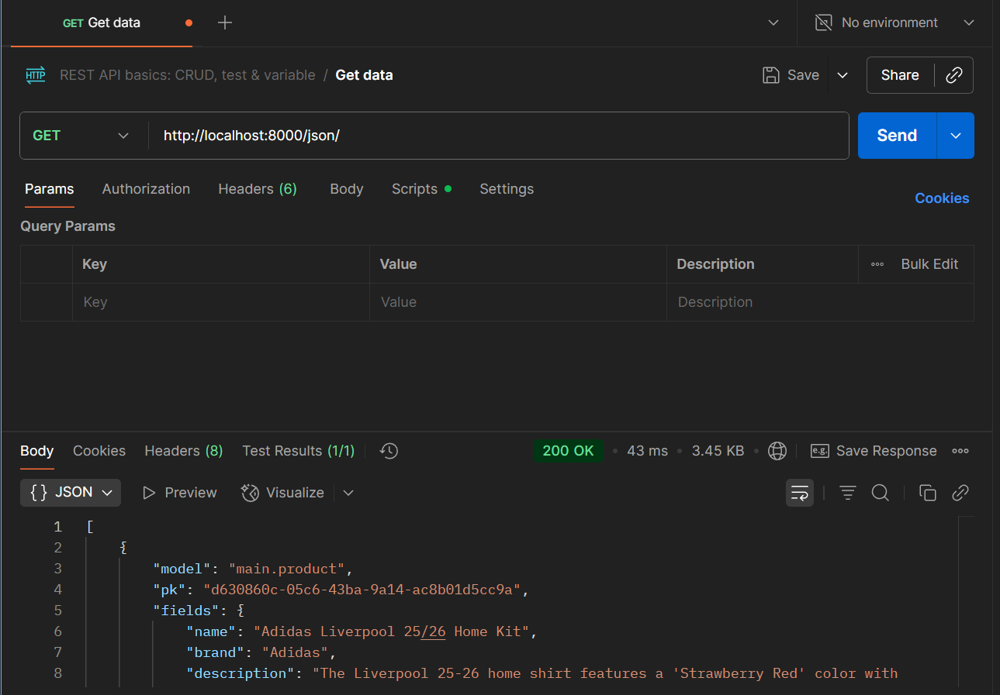
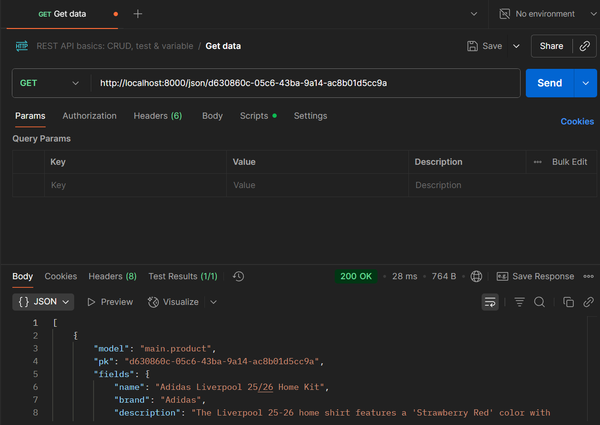

## *Tugas 2*
Tautan menuju aplikasi PWS yang sudah di deploy: 
https://riyaan-baihaqi-burhansigmasport.pbp.cs.ui.ac.id/

1. Untuk memenuhi checklist, saya memulai dengan persiapan direktori dan inisialisasi lingkungan virtual. Langkah ini bertujuan untuk mengisolasi dependensi proyek. Selanjutnya, semua dependensi yang dibutuhkan oleh proyek diinstal dan melakukan konfigurasi awal dilakukan pada file settings.py, termasuk penyesuaian basis data yang akan menggunakan SQLite untuk pengembangan lokal dan PostgreSQL untuk produksi, serta pengaturan ALLOWED_HOSTS untuk keamanan. Untuk memverifikasi bahwa konfigurasi awal telah berhasil, saya pun menjalankan server pengembangan lokal.

Setelah struktur proyek dasar terbentuk, sebuah aplikasi baru bernama main dibuat di dalam proyek. Kemudian, aplikasi tersebut dimuat ke dalam daftar INSTALLED_APPS pada file settings.py agar dapat dikenali dan diintegrasikan dengan proyek Django secara keseluruhan. Selanjutnya pada file models.py di dalam aplikasi main, sebuah model data bernama Product didefinisikan untuk merepresentasikan struktur tabel produk dalam basis data dan memiliki atribut-atribut sebagai berikut:
• name: CharField, untuk menyimpan nama produk.
• price: IntegerField, untuk menyimpan harga produk.
• description: TextField, untuk deskripsi detail produk.
• thumbnail: URLField, untuk menyimpan tautan gambar produk.
• category: CharField, untuk mengkategorikan produk.
• is_featured: BooleanField, untuk menandai apakah produk tersebut unggulan atau tidak.

Setelah model didefinisikan, proses migrasi basis data (makemigrations dan migrate) dijalankan untuk membuat skema tabel yang sesuai di dalam basis data.

Berikutnya, fungsi tampilan (view) dikonfigurasi dalam file views.py pada aplikasi main. Fungsi ini dirancang untuk merender sebuah template HTML dan mengirimkan data konteks yang berisi nama dan kelas pengembang. Selain itu, file template bernama main.html dibuat dan dikustomisasi untuk menampilkan data yang diterima dari view secara dinamis. 

Proses URL routing dilakukan dalam dua tahap untuk menghubungkan permintaan pengguna ke view yang sesuai:
1. Routing Tingkat Aplikasi: Di dalam direktori aplikasi main, dibuat sebuah file urls.py untuk memetakan sebuah pola URL ke fungsi view yang telah dibuat sebelumnya.
2. Routing Tingkat Proyek: File urls.py pada direktori utama proyek dimodifikasi untuk mengarahkan (include) semua permintaan dengan awalan path tertentu ke file urls.py milik aplikasi main.

Setelah semua fungsionalitas terverifikasi secara lokal, kode sumber proyek diunggah ke repositori GitHub dan selanjutnya di-deploy ke Pacil Web Service (PWS). Proses ini membuat aplikasi dapat diakses secara publik melalui internet oleh pengguna lain.

2. Bagan request client tercantum pada link berikut.
https://www.canva.com/design/DAGyS8boMRM/VHdNjEqB7Lo7h95izYr-JA/edit?utm_content=DAGyS8boMRM&utm_campaign=designshare&utm_medium=link2&utm_source=sharebutton
Penjelasan bagan ialah sebagai berikut.
Request client diterima oleh urls.py level proyek sebagai gerbang utama atau distributor yang mengarahkan ke aplikasi yang relevan menggunakan fungsi include(). Jika tidak ada aplikasi yang relevan, Django akan menampilkan Error 404 dan menampilkan page not found kepada client. Di dalam urls.py level aplikasi, pola URL yang lebih spesifik dicocokkan dengan fungsi yang sesuai pada file views.py. Fungsi di views.py kemudian mengeksekusi logika yang diperlukan. Jika logika memerlukan interaksi dengan database, maka view akan berkomunikasi dengan models.py. Models.py berfungsi sebagai jembatan ke database yang menerjemahkan permintaan dari view menjadi quary untuk mengambil atau memanipulasi data. Setelah mendapatkan data yang dibutuhkan, view akan memuat sebuah berkas .html dan memasukkan data tersebut ke dalamnya. Template ini akan dirender menjadi halaman HTML utuh dan dikemas sebagai respons dan dikirim kembali ke browser client.

3. File settings.py berfungsi sebagai pusat kendali keseluruhan proyek Django. Di dalam file ini semua konfigurasi fundamental dilakukan, seperti mendaftarkan aplikasi main ke dalam INSTALLED_APPS agar dikenali oleh proyek, mengatur koneksi ke basis data yang akan digunakan (baik SQLite untuk pengembangan maupun PostgreSQL untuk deployment di PWS), dan sebagainya. Selain itu, settings.py juga digunakan untuk mengelola pengaturan keamanan seperti SECRET_KEY dan ALLOWED_HOSTS dan mendefinisikan lokasi file template dan file statis. File ini juga adalah peta konfigurasi yang menghubungkan semua komponen, mulai dari aplikasi, model, basis data, hingga URL agar dapat bekerja sama secara harmonis sebagai satu kesatuan aplikasi web.

4. Cara kerja migrasi database di Django melalui proses dua langkah yang terotomatisasi untuk sinkronisasi perubahan pada file models.py dengan struktur database. Pertama, perintah makemigrations akan memindai model untuk mendeteksi perubahan, lalu membuat sebuah "blueprint" atau yang berisi instruksi perubahan tanpa menyentuh database. Selanjutnya, perintah migrate akan membaca "blueprint" lalu menerjemahkannya menjadi perintah SQL dan mengeksekusinya untuk mengubah struktur tabel di dalam database. Sistem ini pada berfungsi sebagai version control untuk skema databas dan memastikan perubahan dapat dilacak serta diterapkan secara konsisten di lingkungan pengembangan maupun produksi.

5. Django menjadi titik awal pembelajaran perangkat lunak karena telah menyediakan hal-hal yang dibutuhkan untuk membuat website, seperti sistem untuk mengelola database tanpa perlu menulis kode SQL yang rumit, panel admin otomatis untuk mengelola data, dan sistem login pengguna yang siap pakai. Hal ini membuat pengguna bisa berfokus pada logika utama aplikasi dan dapat melihat hasil yang instan. Selain itu, Django punya struktur yang rapi sehingga aplikasi menjadi lebih yang terorganisir, aman, dan mudah dikembangkan di kemudian hari.

6. Menurut saya, penjelasan yang diberikan sudah sangat jelas dan sangat membantu. Terima kasih kakak-kakak asisten dosen yang telah menyusun tutorial ini.

## *Tugas 3* 

1. Dalam pengimplementasian sebuah platform, data delivery diperlukan untuk memastikan data dapat sampai ke tujuan dengan cepat, aman, dan konsisten. Tanpa mekanisme pengiriman data yang baik, informasi yang dikumpulkan tidak akan bisa dimanfaatkan secara optimal. Data delivery juga menjamin kecepatan arus informasi, mendukung skalabilitas saat menangani data dalam jumlah besar, serta menjaga keamanan dan kepatuhan terhadap regulasi. Hal ini akan meningkatkan pengalaman pengguna dengan menghadirkan informasi yang selalu relevan.

2. Menurut saya, XML dan JSON sama baiknya dalam hal menyimpan serta bertukar data. Namun, JSON lebih populer karena lebih sederhana, ringkas, dan efisien dibanding XML yang cenderung dengan banyak tag. Di sisi lain, XML dapat digunakan untuk struktur data kompleks dan validasi ketat sehingga banyak dipakai di sistem lama atau enterprise. Namun, karena kebutuhan aplikasi web dan mobile saat ini lebih menekankan kecepatan, kemudahan integrasi, dan efisiensi pertukaran data, JSON lebih banyak dipilih dibanding XML.

3. Method is_valid() pada sebuah form Django berfungsi untuk memeriksa apakah data yang dikirim melalui form sudah memenuhi aturan validasi yang ditentukan baik secara validasi bawaan Django maupun validasi tambahan yang dibuat oleh client. Saat dipanggil, is_valid() akan menjalankan serangkaian pengecekan terhadap input, lalu mengembalikan nilai True jika semua field valid, atau False jika ada error. Hal ini diperlukan dalam proses pengolahan form dimana aplikasi harus memastikan bahwa data yang diterima benar, aman, dan sesuai dengan aturan sebelum disimpan ke database atau diproses lebih lanjut. Dengan mekanisme ini, Django membantu mencegah terjadinya inkonsistensi data, bug, maupun potensi celah keamanan akibat input yang tidak sesuai.

4. csrf_token dalam Django digunakan untuk melindungi aplikasi dari serangan CSRF (Cross-Site Request Forgery) dimana penyerang “menyamar” menjadi pengguna yang mengirimkan form dari situs sah padahal sebenarnya pengguna diarahkan ke situs palsu yang menyisipkan request tersembunyi. Sebagai langkah antisipasinya, csrf_token dapat digunakan dimana csrf_token akan membuat token berupa string acak unik yang disisipkan secara otomatis di setiap form HTML. Token ini kemudian akan diverifikasi server saat form dikirim. Dengan cara ini, hanya request yang benar-benar berasal dari halaman asli aplikasi (bukan dari situs berbahaya lain) saja yang akan dianggap valid.

5. Sebagai langkah awal, saya membuat skeleton code yang berfungsi sebagai kerangka dasar dari views. Pada tahap ini, saya menambahkan sebuah direktori baru bernama templates di root folder, kemudian membuat berkas base.html yang berfungsi sebagai template utama dan dapat digunakan sebagai kerangka umum bagi halaman-halaman web lainnya dalam proyek. Agar berkas tersebut dapat dikenali oleh Django, saya melakukan konfigurasi pada settings.py sehingga base.html dapat terdeteksi sebagai template. Setelah itu, saya mengatur main.html untuk menggunakan base.html sebagai kerangka utamanya.

Berikutnya, saya membuat form input data pada forms.py dengan sejumlah fields, yaitu name, brand, description, category, thumbnail, is_featured, dan price. Setelah form selesai dibuat, saya melakukan konfigurasi tambahan pada direktori aplikasi, khususnya di views.py, menambahkan path pada urls.py, serta menyertakan kode yang memungkinkan pengguna diarahkan ke halaman form di main.html. Untuk menampilkan form input dan detail produk pada football shop, saya juga menambahkan dua berkas HTML baru.

Dari sisi keamanan, saya menambahkan konfigurasi CSRF_TRUSTED_ORIGINS di settings.py untuk memastikan form yang digunakan terlindungi dari serangan CSRF. Selain itu, saya membuat fungsi tambahan agar situs web dapat mengembalikan data dalam beberapa format, yaitu JSON, XML, XML by ID, dan JSON by ID, serta menambahkan routing untuk mengakses format-format tersebut. Sebagai tahap akhir, saya menggunakan Postman untuk melakukan pengujian sekaligus memastikan proses data delivery berjalan dengan baik.

 --> XML
 --> XML by ID
 --> JSON
 --> JSON by ID

## *Tugas 4* 

1. AuthenticationForm adalah kelas formulir siap pakai dari Django dengan tujuan untuk menangani proses login pengguna (autentikasi). Ketika data dikirimkan melalui formulir, Django secara otomatis akan melakukan validasi dengan memeriksa apakah kombinasi username dan password yang dimasukkan cocok dengan data pengguna yang ada di database dan apakah akun pengguna tersebut dalam status aktif. Kelebihan dari kelas formulir ini ialah memiliki keamanan yang terjamin serta mudah diimplementasikan karena terintegrasi secara mulus dengan ekosistem autentikasi Django lainnya serta dapat dimodifikasi sesuai kebutuhan. Kekurangannya ialah tampilannya yang generik dan minimalis sehingga untuk mendapatkan tampilan formulir yang menarik perlu dilakukan rendering setiap kolom secara manual.

2. Autentikasi ialah proses verifikasi identitas untuk memastikan identitas yang diberikan sesuai. Proses autentikasi akan memvalidasi kredensial pengguna seperti meminta input berupa username dan password. Sedangkan otorisasi ialah proses untuk menentukan hak akses per masing-masing identitas. Proses otorisasi akan mengizinkan tindakan pengguna sesuai peran atau perizinan yang ada.

3. *Cookies* memiliki kelebihan diantaranya mudah untuk diimplementasikan, beban server yang ringan, serta persisten. Kekurangannya, cookies memiliki keamanan yang rendah karena data yang bersifat transparan, ukuran yang terbatas, serta memberikan beban lebih terhadap bandwidth. *Session* memiliki kelebihan diantaranya memiliki keamanan lebih tinggi karena disimpan di server, kapasitas penyimpanan lebih besar, serta dapat dikontrol secara terpusat. Kekurangannya, session akan memberikan beban yang lebih kepada server, bergantung pada cookies, serta manajemennya yang lebih sulit.

4. Secara default, penggunaan cookies tidak aman karena disimpan di klien (browser) sehingga rentan terhadap berbagai serangan siber. Potensial serangan yang dapat terjadi diantaranya Cross Site Scripting (XSS), Cross-Site Request Forgery (CSRF), dan Session Hijacking. Cara Django menangani ketiga risiko ini diantaranya melakukan HTML Escaping pada semua variabel yang di render (untuk mencegah Cross Site Scripting (XSS)), menghasilkan token CSRF yang unik untuk setiap pengguna (untuk mencegah CSRF), serta mengonfigurasi atribut keamanan pada cookies.

5. Pertama,saya melakukan aktivasi virtual environment untuk memastikan isolasi dependensi dan menjaga integritas proyek. Setelah environment siap, fungsionalitas registrasi pengguna diimplementasikan dengan memanfaatkan form bawaan Django yakni UserCreationForm, di dalam views.py untuk mengelola validasi data dan pembuatan akun baru. Proses ini didukung oleh pembuatan template antarmuka register.html serta pendaftaran path URL yang sesuai pada urls.py untuk menangani permintaan pendaftaran dari pengguna.

Selanjutnya, saya membuat fungsi login dan logout untuk autentikasi. Proses login diimplementasikan melalui sebuah fungsi di views.py yang menggunakan AuthenticationForm, didukung oleh template login.html, serta konfigurasi URL yang relevan. Sementara itu, fungsi logout juga saya kembangkan dan tautannya diintegrasikan ke dalam template utama aplikasi untuk memudahkan akses. Setelah mekanisme autentikasi ini terbentuk, sistem otorisasi diterapkan untuk membatasi akses ke halaman-halaman tertentu, sehingga hanya pengguna yang terautentikasi yang dapat mengakses konten yang bersifat privat.

Selanjutnya, saya juga memanfaatkan cookies untuk manajemen state khususnya untuk mencatat dan menampilkan informasi waktu login terakhir. Logika untuk membuat cookie saat login berhasil dan menghapusnya saat logout diimplementasikan di dalam views.py. Pada tahap akhir, saya melakukan integrasi antara model User bawaan Django dengan model data aplikasi. Hal ini melibatkan modifikasi pada views.py untuk mengaitkan data spesifik dengan pengguna yang sedang aktif, serta penyesuaian pada template terkait, seperti main.html dan product_detail.html, untuk memastikan penyajian data yang terpersonalisasi sesuai dengan pengguna yang mengaksesnya.

## "Tugas 5"
1. Berdasarkan urutan CSS Selector dari yang paling tinggi ke yang paling rendah, selector diurutkan berdasarkan tingkat kekhususannya dimulai dari inline styles, kemudian ID selectors, kemudian class, attribute, dan pseudo-class selectors, dan terakhir type selectors dan pseudo-elements selectors. Inline styles memiliki prioritas utama dikarenakan ditulis langsung pada atribut style di dalam elemen HTML. Prioritas berikutnya ialah selector melalui ID yang menyeleksi berdasarkan id uniknya dan biasa ditandai dengan tanda pagar. Prioritas berikutnya ialah class selectors, attribute selectors, serta pseudo-class selectors yang memiliki kedudukan yang sama. Class selectors menyeleksi berdasarkan class tertentu (ditandai dengan titik), attribute selectors menyeleksi berdasarkan atribut tertentu (ditandai dengan kurung siku), serta pseudo-class selectors menyeleksi elemen dalam kondisi tertentu (ditandai dengan titik dua (:)). Prioritas terakhir ialah type selectors dan pseudo-element selectors yang memiliki kedudukan yang sama. Type selectors menyeleksi berdasarkan jenis HTML tertentu serta pseudo-elements berdasarkan bagian tertentu dari suatu elemen. 

2. Responsive design penting dalam pengembangan aplikasi web karena memastikan pengalaman pengguna (UX) optimal di berbagai perangkat dimulai dari desktop, tablet, hingga smartphone. Tanpa desain yang responsif, situs web yang terlihat bagus dan pas di layar yang lebih besar akan sulit dibaca dan dinavigasi di layar kecil. Hal ini dapat membuat pengguna meninggalkan situs. Dengan menerapkan responsive design, elemen-elemen seperti tata letak, gambar, dan ukuran font secara otomatis menyesuaikan diri dengan ukuran layar sehingga konten tetap mudah diakses dan fungsional di perangkat apa pun.

Contoh aplikasi yang sudah menerapkan responsive design dengan baik ialah Detik.com yang saat diakses melalui desktop, tampilannya akan menyajikan beberapa kolom berita dan menu navigasi yang lengkap. Namun ketika dibuka di smartphone, tata letaknya berubah menjadi satu kolom yang lebih sederhana, dan menu navigasinya disembunyikan di dalam ikon "hamburger" untuk menghemat ruang. Sebaliknya, contoh situs yang belum sepenuhnya responsif ialah siakng karena saat dibuka di perangkat seluler hanya menampilkan versi desktop yang diperkecil sehingga teksnya menjadi sangat kecil dan tautannya sulit untuk diklik tanpa memperbesar tampilan.

3.  Padding adalah ruang transparan di antara konten elemen (seperti teks atau gambar) dan border-nya. Sedangkan border adalah garis yang mengelilingi padding dan konten. Terakhir, margin adalah ruang transparan di luar border yang berfungsi untuk menciptakan jarak antara elemen tersebut dengan elemen lainnya.

Untuk mengimplementasikannya, dapat menggunakan properti masing-masing. Misalnya, untuk sebuah elemen div, kodenya dapat dibuat sebagai berikut: 

div { padding: 15px; border: 2px solid gray; margin: 20px; }. 

Kode ini akan memberikan ruang sebesar 15 piksel di dalam border, border abu-abu solid setebal 2 piksel di sekelilingnya, dan jarak sebesar 20 piksel dari elemen lain di luarnya.

4. Flexbox (Flexible Box Layout) adalah model tata letak satu dimensi yang dirancang untuk mengatur elemen-elemen dalam sebuah baris atau kolom. Kegunaan utamanya ialah untuk mendistribusikan ruang dan menyelaraskan item di dalam container bahkan di kondisi dinamis. Flexbox ideal digunakan sebagai komponen aplikasi yang lebih kecil dan tata letak yang lebih sederhana, seperti mengatur menu navigasi atau memusatkan elemen secara vertikal. 

​Selain flexbox, terdapat pula grid layout yang merupakan model tata letak dua dimensi yang memungkinkan untuk mengatur elemen dalam baris dan kolom secara bersamaan, seperti membuat tabel. Grid sangat cocok untuk tata letak halaman yang lebih besar dan kompleks, seperti mengatur struktur utama sebuah situs web yang terdiri dari header, sidebar, konten utama, dan footer.

5. Saya memulai dengan integrasi framework Tailwind CSS ke dalam template dasar base.html untuk menyediakan fondasi styling di seluruh aplikasi. Selanjutnya, saya fokus pada implementasi fungsionalitas manajemen produk. Fitur "Edit Produk" dikembangkan terlebih dahulu, yang melibatkan pembuatan template baru edit_product.html, penambahan logika pada views.py untuk menangani pengambilan dan pembaruan data, serta pendaftaran path di urls.py. Kemudian sebuah tombol edit kemudian ditambahkan ke main.html untuk menghubungkan ke halaman tersebut. Menggunakan alur kerja yang serupa, fungsionalitas "Hapus Produk" juga diimplementasikan, yang juga memerlukan modifikasi pada views.py dan urls.py serta penambahan tombol aksi di antarmuka utama.

Untuk meningkatkan struktur navigasi dan antarmuka pengguna, komponen navbar dibuat dalam berkas terpisah (navbar.html) dan kemudian diintegrasikan ke dalam main.html menggunakan template tag include. Langkah teknis berikutnya adalah konfigurasi file statis aplikasi. Hal ini dicapai dengan memodifikasi settings.py untuk mendaftarkan direktori statis dan membuat sebuah root folder baru bernama static. Direktori ini digunakan untuk menyimpan aset global seperti global.css dan file gambar. Sebagai langkah akhir, styling kustom dari global.css diterapkan pada masing-masing halaman HTML untuk memastikan kesesuaian visual dan fungsionalitas antarmuka.